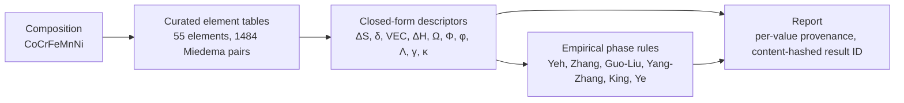

<picture>
  <source media="(prefers-color-scheme: dark)" srcset="https://raw.githubusercontent.com/dfieser/hea-bench/main/docs/assets/banner-dark.png">
  
</picture>

# hea-bench

<!-- mcp-name: io.github.dfieser/hea-bench -->

[](https://doi.org/10.3390/ma19143075)
[](https://doi.org/10.5281/zenodo.20346287)
[](https://pypi.org/project/hea-bench/)
[](https://pypi.org/project/hea-bench/)
[](https://github.com/dfieser/hea-bench/actions/workflows/ci.yml)
[](./LICENSE)

Open, interpretable tools for computing the standard **high-entropy-alloy
(HEA) and high-entropy-oxide (HEO) thermodynamic and geometric
descriptors** and the classic empirical **phase-prediction rules**, from
any composition. Every descriptor is a transparent closed-form expression
over a curated element-property table, validated against the primary
literature. The fitted predictions (hardness, phase prediction sets) carry
calibrated uncertainty and flag alloys unlike their training data.

**Try it now:** <https://dfieser.github.io/hea-bench/>. No install, it runs
entirely in your browser, and every library feature works there: the
calculator for alloys, oxides and ceramics with property and phase
predictions, the experimental dataset, alloy search and experiment
planning, and the benchmark.

<picture>
  <source media="(prefers-color-scheme: dark)" srcset="https://raw.githubusercontent.com/dfieser/hea-bench/main/docs/assets/screenshot-calculator-dark.png">
  
</picture>

<sup>The equimolar Cantor alloy CoCrFeMnNi, as the browser app reports it.
The Python library, the desktop app and this page print the same digits, and
a parity suite keeps it that way.</sup>

> **Using an AI coding agent to integrate this?** See
> [AGENTS.md](./AGENTS.md) for a machine-oriented guide to the API,
> exact return types and units, the fastest path to each task, and the
> mistakes to avoid.

## What it computes

For any composition it reports:

- **Core descriptors:** mixing entropy ΔS<sub>mix</sub>, atomic-size
  mismatch δ, mean melting temperature T<sub>m</sub>, Miedema mixing
  enthalpy ΔH<sub>mix</sub>, valence-electron concentration VEC,
  Yang–Zhang Ω, Pauling electronegativity mismatch Δχ, Mansoori excess
  entropy S<sub>E</sub>, ΔG<sub>ss</sub>, ΔG<sub>max</sub>, King Φ, Ye φ.
- **Phase-prediction rules:** Yeh entropy, Zhang δ, Guo–Liu VEC,
  Yang–Zhang Ω, King Φ, Ye φ, Senkov–Miracle κ, the Tsai σ-phase
  window and Sheikh ductility.
- **Miedema formation enthalpies:** compound / solid-solution /
  amorphous, decomposed into chemical, elastic, structural, and
  topological terms.
- **Your own elements and pair values:** any descriptor or rule, for a
  composition with an element or pair enthalpy that is not tabulated.
- **High-entropy oxides** (`hea_bench.oxides` + the apps' Oxides mode):
  rock-salt, perovskite, fluorite, and pyrochlore formability
  descriptors over Shannon ionic radii with automatic charge-balance
  oxidation-state assignment: per-sublattice configurational entropy,
  cation size disorder, Goldschmidt t / octahedral μ / Bartel τ, the
  fluorite radius-dispersion rule, and the pyrochlore radius-ratio
  window.

Element coverage: 55 elements for alloys (Ag Al Au Be Bi Ca Ce Co Cr
Cu Dy Er Fe Ga Gd Ge Hf Ho In Ir La Li Lu Mg Mn Mo Nb Nd Ni Os Pb Pd
Pr Pt Re Rh Ru Sb Sc Si Sm Sn Sr Ta Tb Th Ti Tm U V W Y Yb Zn Zr,
covering the full experimentally active rare-earth HEA palette plus the
nuclear, solder, and HE-BMG corners); the Miedema pair table covers
75 (1484 of our 1485 pairs; the lone Th-U gap is reported, never
zeroed); the oxide module's Shannon table covers 94.

## How a number gets made

No fitted model sits anywhere in this chain. Each descriptor is a
closed-form expression over curated tables, and the report carries the
literature source of every input alongside the value.



## Four ways to run it, each with every feature

| Part | Where | Best for |
|---|---|---|
| **Web app** | <https://dfieser.github.io/hea-bench/> | anyone, no install |
| **Desktop app** | one portable `.exe`, [download (no install)](https://github.com/dfieser/hea-bench/releases/latest/download/HEA-Bench.exe), the same app in its own window, engine inside, works offline | Windows users who want it local |
| **Python library + CLI** | `pip install "hea-bench[all]"` | scripts and notebooks |
| **MCP server for AI agents** | `pip install "hea-bench[mcp]"`, then `hea-bench-mcp` | Claude, Cursor and other MCP clients, as 24 tools |

Every feature is in all four parts, so pick whichever suits you and you
lose nothing. That is a standing project rule, and CI enforces it:
`tests/test_feature_parity.py` fails whenever a public feature lacks
its library function, its MCP tool or a working app surface, a headless
browser uses every tab of the built site, the built desktop exe goes
through the same steps before it is attached to a release, and a
freshly installed wheel answers every MCP tool. `pip install
hea-bench` alone has no dependencies and covers everything except the
fitted models and the MCP server; the `[all]` extra adds scikit-learn
and the MCP SDK for those.

All four share **one calculation core**. The browser/desktop
core (`web/hea-calculator-core.js`) is a pure-JS port of the Python
library, and `tests/test_web_parity.py` guarantees the two match on all
1484 binary pairs and the canonical multi-element fixtures, while
`tests/test_web_oxides_parity.py` does the same for the oxide module,
down to identical warning messages. The app's Dataset, Design and
Benchmark tabs and its predictions panel run the Python package itself,
unchanged, inside the page (Pyodide, `web/hea-engine-worker.js`), and
`tests/test_web_engine.py` checks that it returns exactly what CPython
returns.

## Quick start (Python)

```bash
pip install hea-bench
```

```python
import hea_bench as hb

cantor = {"Co": 0.2, "Cr": 0.2, "Fe": 0.2, "Mn": 0.2, "Ni": 0.2}

hb.smix(cantor)               # 13.381 J/(mol·K)  = R · ln 5
hb.delta(cantor)              # 3.164 % atomic-size mismatch
hb.vec(cantor)                # 8.0 valence electrons
hb.mixing_enthalpy(cantor)    # -4.16 kJ/mol  (Miedema)
hb.omega(cantor)              # 5.79  (Yang–Zhang)
hb.delta_chi(cantor)          # 0.138 Pauling electronegativity mismatch
hb.s_excess(cantor)           # 0.318 J/(mol·K)  (Mansoori excess entropy)
hb.delta_g_max(cantor)        # -8.00 kJ/mol  (most-negative Miedema pair)
hb.phi_king(cantor)           # 3.533 (King 2016 proxy)
hb.phi_ye(cantor)             # 34.82 (Ye 2015 proxy)

# Apply the canonical rules
from hea_bench.rules import guo_vec, king_phi, yang_omega, ye_phi, zhang_delta
zhang_delta.predict(cantor)          # 'single-phase'
yang_omega.predict(cantor)           # 'single-phase'
guo_vec.predict(cantor)              # 'FCC'
king_phi.predict(cantor)             # 'solid_solution'
ye_phi.predict(cantor)               # 'solid_solution'
```

These Cantor-alloy values are pinned in the test suite as the canonical
sanity check. The rules are simple empirical surrogates, fast screens
rather than predictions, so treat their output accordingly.

### Descriptor backends (optional interop)

Descriptors can also be computed through a pluggable backend. The
default (`native`) is this package's own stdlib implementation; with
`pip install "hea-bench[interop]"` the same interface drives an
installed [HEACalculator](https://github.com/dogusariturk/HEACalculator)
(GPLv3, installed at the user's choice), so a workflow standardized on
its numbers can keep them while using everything downstream here:

```python
from hea_bench.descriptors.backend import get_backend
get_backend("heacalculator").compute(cantor)   # same names, their reference data
```

```bash
hea-bench describe Al0.3CoCrFeNi --backend native
```

The two backends vendor different reference data (radius conventions
differ most), so same-named values legitimately differ; the measured,
per-descriptor comparison lives in
[docs/backend-agreement.md](docs/backend-agreement.md). Quantities
whose implementations differ structurally are deliberately not mapped
onto each other, and the benchmark's published baselines use the
native backend unchanged.

## Quick start (oxides)

```python
from hea_bench import oxides

# Rost 2015 "J14" entropy-stabilized rock salt
j14 = oxides.describe_rock_salt({"Mg": 1, "Co": 1, "Ni": 1, "Cu": 1, "Zn": 1})
j14["descriptors"]["s_config"]       # 13.382 J/(mol·K) = R·ln 5
j14["oxidation_states"]              # all 2+ by charge balance

# Jiang 2018 single-phase high-entropy perovskite
pvk = oxides.describe_perovskite({"Sr": 1}, {"Zr": 1, "Sn": 1, "Ti": 1, "Hf": 1, "Mn": 1})
pvk["descriptors"]["goldschmidt_t"]  # 0.979, inside the 0.92–1.04 window
pvk["verdicts"]["bartel"]            # 'perovskite' (τ = 3.72 < 4.18)
```

Each `describe_*` report carries the solved oxidation states, the
Shannon radii actually used, every descriptor, the formability
verdicts with their windows, and any warnings. See
[`examples/02_oxides_walkthrough.py`](./examples/02_oxides_walkthrough.py)
for the full tour, including the fluorite and pyrochlore screens and
oxidation-state overrides.

## Quick start (ceramics, experimental)

`hea_bench.ceramics` extends the calculator to rock-salt carbides and
nitrides and AlB2-type diborides, composition-only and honest about
what that buys:

```python
from hea_bench import ceramics

hec = ceramics.describe_rock_salt_carbide({"Ti": 1, "Zr": 1, "Hf": 1, "Nb": 1, "Ta": 1})
hec["vec_per_formula_unit"]        # 8.4, with annotated literature reference points
hec["entropy"]                     # all normalization conventions, labelled
```

Reports carry the metal-sublattice entropy in every published
normalization convention (papers switch between them without warning),
VEC with annotated reference points rather than a verdict (the
literature marks points, not one window), and explicit notes on what
is deferred: the size-mismatch descriptor (the field computes it from
DFT binary-cell bond lengths, and adopting a cited table is real
curation work), and entropy-forming-ability or DEED, which are
DFT-ensemble quantities this package cannot and does not claim to
reproduce. Background, citations, and a license audit of candidate
ceramics datasets: [docs/ceramics.md](docs/ceramics.md).

## Quick start (AI agents, MCP)

LLM agents hallucinate descriptor values; this server grounds them.
`hea_bench.mcp_server` exposes every feature of the package over the
[Model Context Protocol](https://modelcontextprotocol.io/) as 24
deterministic tools. The calculator: `parse_composition`, batch
`alloy_descriptors` (with the Miedema enthalpies) and `alloy_rules`,
both taking custom elements and pair values, `omega_sensitivity`,
`oxide_report`, `ceramic_report`, `element_data` and
`element_coverage`. The dataset: `corpus_build` (once, to build the
corpus locally), `corpus_query`, `corpus_describe`, `corpus_export` and
`measured_properties`. Predictions: `predict_properties` with
intervals and `predict_phase_set` with prediction sets, both carrying
the domain flag, and `check_applicability`. Design:
`design_search`, with hard caps on palette, step and candidate count,
and `campaign_suggest`, on a campaign file or an inline campaign. The
benchmark: `benchmark_summary`, `benchmark_run`, `benchmark_folds`,
`benchmark_score` and `coverage_study`. And `about`. Every response
carries units or uncertainty fields, citation keys
where a parametrization is involved, and the library version, so an
agent's reasoning trace contains auditable receipts rather than bare
floats; `about()` reports which capabilities are available in the
running environment, and missing optional extras come back as a clear
message naming the exact install.

```bash
pip install "hea-bench[mcp]"
```

Register it with any MCP client (Claude Desktop, Cursor, ...), for
example in `claude_desktop_config.json`:

```json
{ "mcpServers": { "hea-bench": { "command": "hea-bench-mcp" } } }
```

The `omega_sensitivity` tool is worth singling out: it reports the
per-pair Miedema contributions and how far Ω moves when the dominant
element's pair enthalpies are shifted within the spread of published
compilations, so an agent can ask not just for a number but for how
much to trust it.

## Quick start (browser, no install)

The app runs entirely client-side. Its tabs:

- **Calculator.** Every descriptor, all nine phase rules, the Miedema
  decompositions, the robustness of Ω to the pair table, density, cost,
  hardness with its interval, the phase prediction set and the domain
  flag. Oxides and Ceramics (carbides, nitrides, diborides) are modes of
  the same tab.
- **Dataset.** The consolidated experimental corpus with every source's
  label and paper, filters and CSV download, plus the measured hardness
  and density data.
- **Design.** Composition search with property limits, rule filters and
  the Pareto front, and experiment planning from your own measurements.
- **Benchmark.** The frozen random and family-grouped splits, live
  baseline reruns, scoring of your own predictions, and the coverage
  study.

Two ways to open it:

- Open the hosted site: **<https://dfieser.github.io/hea-bench/>**.
- Or clone the repo, run `python tools/build_web_engine.py` once
  (assembles the pinned in-page engine, about 30 MB), then
  `python -m http.server -d web` and open <http://localhost:8000>.
  Opening `web/index.html` directly from disk also works for the
  calculator, but browsers block the engine on `file://` pages, so the
  other tabs need the local server.

The calculator ships its own documentation: a **Theory** view deriving
every alloy and oxide formula with citations, a grouped, filterable
**Equations** reference, and a grouped **References** bibliography.
Deep links open a view directly (`index.html#theory`,
`#equations`, `#refs`). The parity-critical math lives in
`web/hea-calculator-core.js` and is regression-checked against Python
by the two parity test suites.

## Paired evaluation: the phase-prediction benchmark (experimental)

Published HEA phase-prediction accuracies are mostly measured with
random train/test splits over corpora full of stoichiometric series, so
models are tested on close variants of alloys they trained on. That
largely measures interpolation within known systems.
`hea_bench.benchmark` ships frozen, family-grouped and random paired
splits over a consolidated experimental corpus (~7,700 alloys) and an
evaluator that reports both **side by side**:

```python
from hea_bench.benchmark import evaluate, load_benchmark
print(evaluate(my_model, load_benchmark(task="phase4")).table())
```

A stock random forest over this package's own descriptors scores 0.941
balanced accuracy under the random split and 0.734 under the grouped
one. Neither number is wrong; they answer different questions (new
stoichiometries of known systems versus unseen element systems), and
the gap between them quantifies how much of the random-split score
comes from testing on close relatives of training alloys. For this
interpolation-versus-extrapolation reading of grouped evaluation, see
Li et al., *Commun. Mater.* **6**:9 (2025),
[doi:10.1038/s43246-024-00731-w](https://doi.org/10.1038/s43246-024-00731-w).
Baselines, split digests, and full provenance:
[`docs/benchmark-baselines.md`](./docs/benchmark-baselines.md).

The corpus is built on your machine, once, because its largest source
dataset declares no license and is never redistributed (see
[`data/raw/README.md`](./data/raw/README.md)).
`hea_bench.corpus.build_corpus()` downloads that file from its authors'
repository, accepts it only if its pinned SHA-256 matches, and builds
every corpus version. The apps and the MCP server's `corpus_build` tool
do the same.

## The corpus as a standalone product

The consolidated experimental corpus behind the benchmark is also
addressable directly, with no task or split machinery involved:

```python
from hea_bench.corpus import load_corpus

corpus = load_corpus()                # v0.2.0 (10,290 alloys), every row, full provenance
corpus.describe()                     # counts, families, agreement rate
al_bcc = corpus.query(contains=["Al"], phase="BCC", descriptor_ready=True)
al_bcc.rows[0].raw_labels             # each source's verbatim reported phase
al_bcc.to_csv("al-bcc.csv")
```

Every row carries per-source canonical and verbatim labels, Borg's
processing route and primary-literature DOI where available, and
upstream record identifiers, so a label can be audited without leaving
the package. Provenance chains, per-source license status,
harmonization rules, and known limitations are documented in the
[corpus card](docs/corpus-card.md). `load_corpus()` opens the largest
version, v0.2.0, which adds the LLM-extracted Chizhevskiy database.
`load_corpus(version="0.1.0")` is the hand-curated reference (7,783
alloys) that the benchmark, the phase predictions and the domain flag
always use, so every published number stays put.

## Uncertainty and domain of applicability

`hea_bench.uncertainty` is the trust layer for anything fitted on the
corpus. Conformal prediction wraps any sklearn-style model with
sets or intervals carrying a distribution-free finite-sample coverage
guarantee, and a domain-of-applicability model says whether that
guarantee's exchangeability assumption plausibly holds for your query:

```python
from hea_bench.corpus import load_corpus
from hea_bench.uncertainty import ConformalClassifier, fit_domain

domain = fit_domain(load_corpus(version="0.1.0"))
domain.novelty({"Hf": 0.2, "Nb": 0.2, "Ta": 0.2, "Ti": 0.2, "Zr": 0.2})
# {'element_set_seen': True, 'family_count': ..., 'nearest_family_distance': 0.0,
#  'descriptor_distance': ..., 'element_coverage': True, 'in_domain': True, ...}
```

The novelty output is several deliberately orthogonal signals plus one
conservative `in_domain` flag, because the signals fail differently and
a single scalar invites misreading. Empirical coverage of the conformal
sets on unseen alloy systems, in and out of domain and by element
count, is measured in
[docs/uncertainty-coverage.md](docs/uncertainty-coverage.md). The
released phase sets calibrate by cross-validation over whole alloy
systems, separately for alloys with fewer than four and with four or
more elements, and their 90 percent sets cover 0.900 of unseen-system
alloys on the single-phase task and 0.884 on the phase-structure task.
Read the flag together with the set size rather than either alone.
These tools describe this package's confidence about your composition
on this corpus, nothing else.

## Property predictions, in explicit tiers

`hea_bench.properties` predicts what experimentalists ask about first,
with the data quality stated in the API rather than implied:

```python
from hea_bench.properties import predict_property

predict_property({"Al": 0.2, "Co": 0.2, "Cr": 0.2, "Fe": 0.2, "Ni": 0.2}, "hardness")
# PropertyPrediction(prop='hardness', value=..., unit='HV',
#                    interval=(low, high), alpha=0.1, tier='B',
#                    in_domain=True, n_training=..., ...)
```

Tier A (`density`, `melting_temperature`, and an explicitly indicative
`cost_per_kg` over a date-stamped, per-element-sourced price table) is
closed-form arithmetic over cited tables, validated where experiment
exists ([docs/property-tier-a.md](docs/property-tier-a.md)).
Tier B (`hardness`, behind `pip install "hea-bench[properties]"`) is a
seeded random forest over this package's descriptors wrapped in a
family-grouped conformal interval and a domain flag; its held-out
error, interval calibration, and the decisions that error does and
does not support are stated in
[docs/property-hardness.md](docs/property-hardness.md). Intervals are
wide because the public data is small and heterogeneous; that is the
honest outcome, shown rather than hidden. Properties whose public data
cannot support a defensible held-out error (yield strength across
uncontrolled test temperatures, ductility, corrosion) are deliberately
not shipped, and the model card says why.

## Constrained composition search

`hea_bench.design.search` answers "what should I make" as a screening
aid: a deterministic composition lattice over your palette, filtered by
rule, property, composition, and domain constraints, returning a Pareto
front where every candidate carries its full receipt:

```python
from hea_bench.design import Maximize, Minimize, PropertyConstraint, search

result = search(
    elements=["Al", "Co", "Cr", "Fe", "Ni"],
    n_elements=(4, 5),
    constraints=(PropertyConstraint("density", max=8.0),),
    objectives=(Maximize("hardness"), Minimize("cost_per_kg")),
    step=0.05,
)
result.candidates[0].properties["hardness"].interval   # every number has one
```

The domain constraint is on by default (optimizers exploit model error
hardest where data runs out; opting out is explicit), and
`optimize_bound="lower"` ranks fitted objectives by the conservative
end of their intervals. The search is exhaustive within a hard budget
and refuses loudly rather than sampling silently, so a result is
reproducible by construction. Where measured alloys land relative to a
recovered front is studied honestly in
[docs/design-recovery.md](docs/design-recovery.md); the front is a
prioritization aid, not a set of answers.

## Active-learning campaigns (bring your own measurements)

`hea_bench.design.campaign.Campaign` runs the loop that creates repeat
usage: observe your own measurements, get a ranked next batch, keep
everything in a plain JSON file on your disk (no accounts, no server,
no telemetry):

```python
from hea_bench.design.campaign import Campaign

campaign = Campaign("hardness", ["Al", "Co", "Cr", "Fe", "Ni"])
campaign.observe({"Al": 0.1, "Co": 0.25, "Cr": 0.2, "Fe": 0.25, "Ni": 0.2}, 430.0)
campaign.suggest(n=5)     # each Suggestion prints its interval and domain flag
campaign.save("my-campaign.json")
```

The surrogate is a seeded random forest. Each suggestion carries a 90
percent conformal interval set from the forest's out-of-bag errors, so
calibration costs none of your measurements. Acquisition is expected
improvement or UCB with
batched picks via the believer heuristic, and hardness campaigns warm
start from the Borg records inside your palette so the loop is useful
before your tenth sample. Below 10 informative rows it refuses rather
than pretending. Two replays on the Borg hardness record, the loop
against random selection with the intervals' coverage, and a
year-ordered replay on Al-Co-Cr-Fe-Ni, are in
[docs/campaign-replay.md](docs/campaign-replay.md).

## A note on Ω near ΔH<sub>mix</sub> ≈ 0

`Ω = Tm·ΔSmix / |ΔHmix|` diverges as ΔH<sub>mix</sub> → 0, so for
near-ideal alloys (|ΔH<sub>mix</sub>| ≲ 1–2 kJ/mol) the Ω *magnitude* is
extremely sensitive to the choice of Miedema pair table (sources
disagree most on Mn). The phase verdict (Ω ≫ 1.1) stays robust even when
the number does not, so read Ω qualitatively in that regime.

## Project layout

```
hea-bench/
├── src/hea_bench/
│   ├── descriptors/     ΔS_mix, δ, VEC, T_m, ΔH_mix, Ω, S_E, φ + data tables
│   ├── rules/           the nine empirical phase-prediction rules
│   ├── oxides/          HEO module: families, oxidation-state solver,
│   │                    Shannon radii (94 elements, vendored from pymatgen)
│   ├── ceramics/        carbides, nitrides, diborides
│   ├── corpus/          the experimental corpus: build_corpus, load_corpus
│   ├── benchmark/       frozen family-grouped + random paired splits and evaluation
│   ├── properties/      density, melting point, cost, hardness
│   ├── uncertainty/     conformal sets and intervals, phase sets, domain flag
│   ├── design/          composition search and campaigns
│   ├── mcp_server.py    the MCP server (hea-bench-mcp)
│   ├── webapp.py        the bridge the in-page engine calls
│   ├── custom.py        custom elements and pair values
│   ├── composition.py   formula parser, normalizer
│   ├── constants.py     R = 8.314
│   └── cli.py           command-line entry point
├── tests/               unit tests + BOTH Python↔JS parity suites
├── web/                 landing page + self-contained calculator (+ MathJax)
├── src-tauri/           native desktop wrapper (Rust/Tauri)
├── examples/            Cantor-alloy and oxides walkthroughs (.py + .ipynb)
└── pyproject.toml
```

## Development

```bash
git clone https://github.com/dfieser/hea-bench
cd hea-bench
pip install -e ".[dev]"
python -m pytest tests/ -q          # includes the Python↔JS parity test (needs Node)
```

The HTML calculator (`web/index.html` over
`web/hea-calculator-core.js`) is an independent JavaScript
implementation of the same descriptors and rules. When you modify the
Python descriptor code, update the JS core to match and re-run
`tests/test_web_parity.py` and `tests/test_web_oxides_parity.py` so the
surfaces don't drift. The element data tables inside the JS core are
generated from the Python library by `tests/data/_sync_js_tables.py`
and `tests/data/_sync_js_oxide_tables.py`. Regenerate them, never
hand-edit them.

## License

[MIT](./LICENSE). The vendored
[matminer Miedema data files](./src/hea_bench/descriptors/data/) remain
under their upstream BSD-3-Clause license, preserved at
[`descriptors/data/LICENSE.matminer.txt`](./src/hea_bench/descriptors/data/LICENSE.matminer.txt).

## Contributing and support

Contributions and bug reports are welcome. See
[CONTRIBUTING.md](./CONTRIBUTING.md) for development setup and the
testing convention.

Report a bug or request a feature in the
[issue tracker](https://github.com/dfieser/hea-bench/issues). Ask a
question or float an idea in
[Discussions](https://github.com/dfieser/hea-bench/discussions), where
the Q&A category is the right place for how a descriptor is defined,
which rule applies to a composition, or why two sources disagree.
Answers there stay findable for the next person with the same question.
For direct contact, email the maintainer at `davjfies@gmail.com`.
Participation is governed by the [Code of Conduct](./CODE_OF_CONDUCT.md).

## Acknowledgements

**Yen-Ming Horng** ([@infinitus01](https://github.com/infinitus01)),
Independent Researcher, Taiwan. External reproducibility and
documentation review. Reported the `delta_g_max` documentation contract
mismatch corrected in v2.1.4.

External reviews of this kind cover reproducibility and
documentation-to-implementation consistency. They are not a validation
or endorsement of the underlying scientific conclusions.

## Citation

If you use hea-bench in your work, please cite the paper that
describes it:

> Fieser, D.; Dewanjee, U.; Hu, A. HEA-Bench: An AI-Agent-Optimized
> Calculator of High-Entropy Alloy and Oxide Descriptors and
> Phase-Prediction Rules. *Materials* **2026**, *19*, 3075.
> <https://doi.org/10.3390/ma19143075>

```bibtex
@article{ma19143075,
  author         = {Fieser, David and Dewanjee, Unmanaa and Hu, Anming},
  title          = {{HEA-Bench}: An {AI}-Agent-Optimized Calculator of High-Entropy Alloy and Oxide Descriptors and Phase-Prediction Rules},
  journal        = {Materials},
  volume         = {19},
  year           = {2026},
  number         = {14},
  article-number = {3075},
  issn           = {1996-1944},
  doi            = {10.3390/ma19143075},
  url            = {https://www.mdpi.com/1996-1944/19/14/3075},
}
```

Machine-readable metadata, including this preferred citation, is in
[`CITATION.cff`](./CITATION.cff) (GitHub's "Cite this repository"
button uses it). To reference the exact software version you used,
additionally cite the Zenodo archive: the concept DOI
[10.5281/zenodo.20346287](https://doi.org/10.5281/zenodo.20346287)
always resolves to the latest version.

When citing hea-bench, please also cite the primary sources for the
parametrizations it implements: de Boer et al. 1988 for the Miedema
model, the rule papers (Yeh 2004, Zhang 2008, Guo–Liu 2011, Yang–Zhang
2012, King 2016, Ye 2015), the oxide primaries (Shannon 1976,
Goldschmidt 1926, Bartel 2019, Spiridigliozzi 2021, Subramanian 1983),
matminer for the vendored pair table, and pymatgen for the
Shannon-radius digitization. The full grouped bibliography is in the
calculator's References view.

## Disclaimer

Descriptor values and rule predictions reported by hea-bench are
**empirical estimates** for research and informational purposes only.
The rules and descriptors are semi-empirical surrogates with known
limitations. No warranty is made as to accuracy, completeness, fitness
for any particular purpose, or suitability for material qualification.
Do not use these outputs as the sole basis for engineering design or
material qualification without independent verification by validated
thermodynamic methods (e.g. CALPHAD or DFT).

Software is provided **"as is"** under the [MIT License](LICENSE).
Vendored Miedema elemental parameters from
[matminer](https://github.com/hackingmaterials/matminer) remain under
their upstream BSD-3-Clause license; see
[`src/hea_bench/descriptors/data/LICENSE.matminer.txt`](./src/hea_bench/descriptors/data/LICENSE.matminer.txt).
